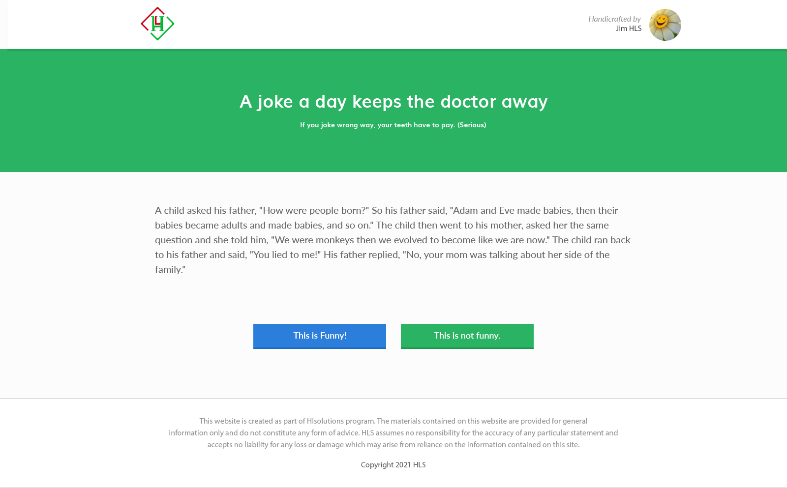

# Welcome to HLS interview!!

# Jokee Single Serving Website
This is a PHP evaluation test to create a single serving website that displays jokes for user to vote.




## Requirements
This app will display a single joke for the user to read.
After reading the joke, the user will like or dislike the joke.
The app will record the vote in database and then show another joke for the user to read.
When there is no more jokes to show, the app will display a `"That's all the jokes for today! Come back another day!"` message.

There is no need to display the result of the votes.
User should not see the same joke twice.
User do not need to register or login to view the joke or vote for the joke.

## Technical Note
App will use cookie to track if a user has voted for a joke.
It is okay if the user clears his cookie and votes again.

## Rules
Coder will be given a project to code and the code will be the basis of evaluation. Coder is expected to follow the rules below:

- A week to finish for Internship
- You can ask any question to the tester anytime
- Can use Internet and any of your previous codes
- No remote git - No copying others - No discussion
- Work like you will continue the project

## Submission of work
After you have finished your work, please submit it as followed:
- Push your code to github and public access
- Push all commits on the master branch only
- Share github repo to tester

Tester will draw your git commits to evaluate your code and also test your app on Heroku.

## Evaluation Criterion
Coder must finished at least 50% of the requirements to be given a pass.
Evaluation will be based on speed, code quality and critical thinking.
Grading is pessimistic - You will not get an A unless you clearly show you are an A. Some signs of an A is not enough.

The general grading is such that

Grade | What it means
------|------------------------
A     | Above our standard
B     | Met our standard
C     | Not good enough
D     | This is seriously not good
E     | Why should we hire you?


The evaluation form for a coder is as below:
```
Name:
Date of Evaluation:

Completeness of project (%):
Bonus completeness (%):
Overall Grade:

Git Commits
A – Great commit messages and structure
B – Good commit messages and structure
C – Okay commit messages and structure
D – Poor commit messages and strucuture
E – No use of git

Test Coverage
A – Critical paths are covered
B – Some critical paths are covered
C – Few critical paths are covered
D – Little or no test cases
E – No test cases!!!

PHP Laravel
A – Above minimum standard
B – Met all minimum standard
C – Met some minimum standard
D – Fail to meet minimum standard
E – Disappointing standard

ReactJS
A – Above minimum standard
B – Met all minimum standard
C – Met some minimum standard
D – Fail to meet minimum standard
E – Disappointing standard

HTML
A – Well-structured and easy to read
B – Readable and some structure
C – Hard to read but can still understand
D – Messy and very difficult to read
E – Impossible to read and understand

CSS
A – Well-structured and easy to read
B – Readable and some structure
C – Hard to read but can still understand
D – Messy and very difficult to read
E – Impossible to read and understand

Javascript
A – Well-structured and easy to read
B – Readable and some structure
C – Hard to read but can still understand
D – Messy and very difficult to read
E – Impossible to read and understand

Difficulties faced by candidate:

Comments by tester:
```

## Bonus Points
+ Implemented design fully
+ The app is mobile responsive.
+ Joke is displayed
+ Can deploy to somewhere, prefer heroku
+ Eslint is set up

## Jokes Content

A child asked his father, "How were people born?"
So his father said, "Adam and Eve made babies, then their babies became adults and made babies, and so on."

The child then went to his mother, asked her the same question and she told him, "We were monkeys then we evolved to become like we are now."

The child ran back to his father and said, "You lied to me!"
His father replied, "No, your mom was talking about her side of the family."

-----

Teacher: "Kids,what does the chicken give you?"
Student: "Meat!"
Teacher: "Very good! Now what does the pig give you?"
Student: "Bacon!"
Teacher: "Great! And what does the fat cow give you?"
Student: "Homework!"

-----

The teacher asked Jimmy, "Why is your cat at school today Jimmy?"
Jimmy replied crying, "Because I heard my daddy tell my mommy, 'I am going to eat that pussy once Jimmy leaves for school today!'"

-----

A housewife, an accountant and a lawyer were asked "How much is 2+2?"
The housewife replies: "Four!".
The accountant says: "I think it's either 3 or 4.  Let me run those figures through my spreadsheet one more time."
The lawyer pulls the drapes, dims the lights and asks in a hushed voice, "How much do you want it to be?"
